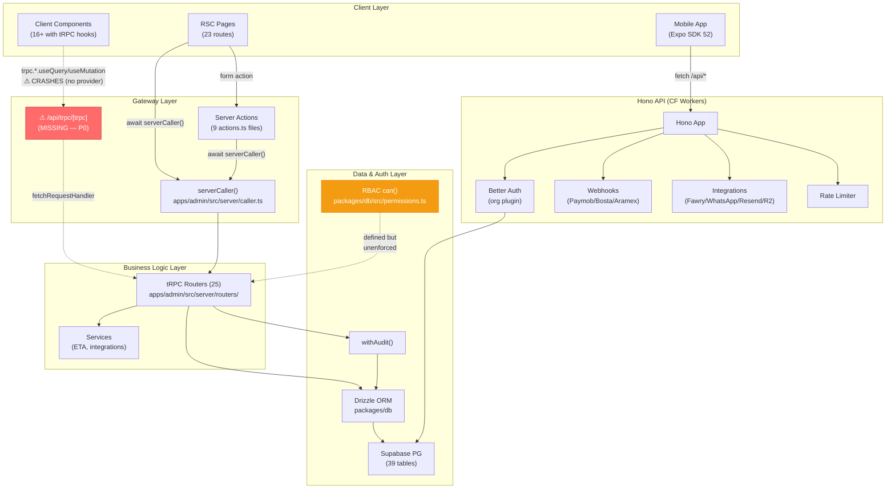
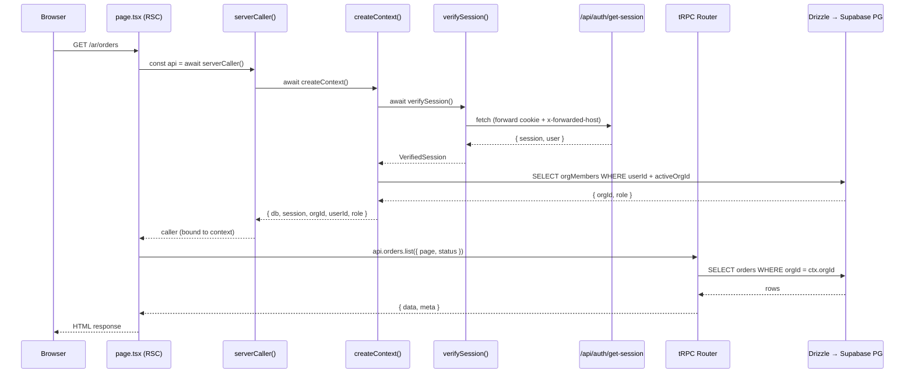
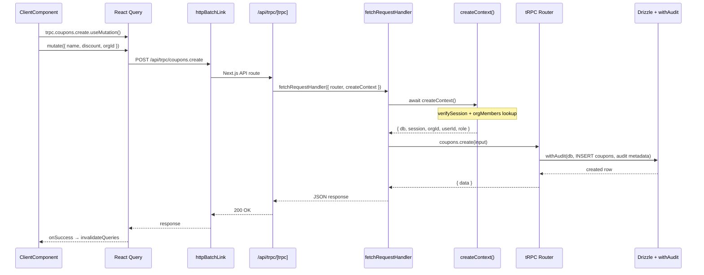
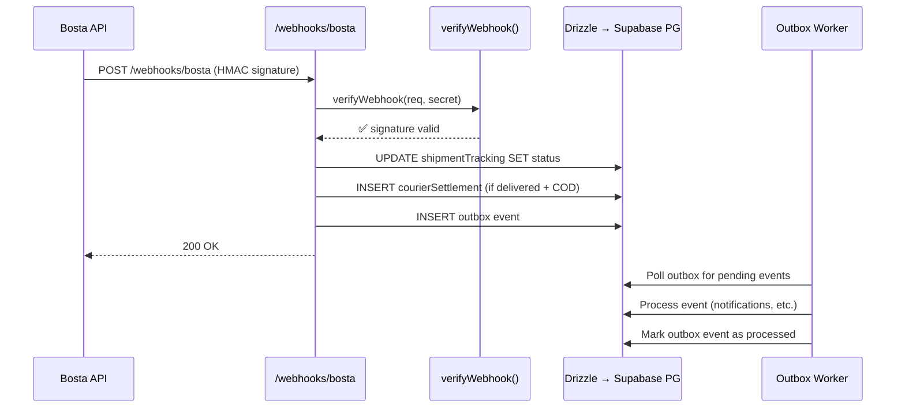

# IRTH OS — Project Master Plan

> **Document purpose**: single source of truth for project architecture, current state,
> verified findings, and the prioritized fix / refactor / enhance roadmap.
> No code changes live in this file — future sessions execute the roadmap phase by phase.

---

## Table of Contents

1. [Executive Summary](#1-executive-summary)
2. [Repository Structure](#2-repository-structure)
3. [Layer Architecture](#3-layer-architecture)
4. [Request Lifecycle Flows](#4-request-lifecycle-flows)
5. [Data Model Map](#5-data-model-map)
6. [Auth & Tenancy](#6-auth--tenancy)
7. [Phase History](#7-phase-history)
8. [Static-Analysis Triage](#8-static-analysis-triage)
9. [Fix / Refactor / Enhance Roadmap](#9-fix--refactor--enhance-roadmap)
10. [Verification Strategy](#10-verification-strategy)
11. [Appendix](#11-appendix)

---

## 1. Executive Summary

**IRTH OS** is an Arabic-first (RTL), multi-tenant e-commerce / ERP platform
targeting the Egyptian market. It is built as a **pnpm + Turborepo monorepo**
with three apps and four shared packages.

| Dimension | Value |
|---|---|
| Stack | Next.js 15.3 / React 19, Hono on CF Workers, Expo SDK 52, Drizzle + Supabase PG |
| Admin dashboard | 23 routes, 25 tRPC routers (≈ 122 procedures), ~4,015 LOC |
| API service | Better Auth (org plugin), HMAC webhooks (Paymob / Bosta / Aramex), rate limiting |
| Mobile | Expo, Arabic-only, orders + products browsing |
| DB | 39 tables, `orgId` on every domain table, `withAudit` wrapper, RBAC matrix (12 resources) |
| CodeFlow health | 69 / 100 (many false positives triaged — see §8) |
| Graph analysis | 2,179 nodes / 3,182 edges / 189 communities |

### Current state

- **Phase 1 MVP** — ✅ live (dashboard, orders, products, categories, inventory, settings, auth).
  These pages use `serverCaller()` + server actions exclusively → working.
- **Phases 2–5 UIs** — built but **non-functional at runtime**. All 16+ client
  components call `trpc.*.useQuery/useMutation` hooks, but the tRPC client
  provider is **never wired** (no `QueryClientProvider`, no `trpc.Provider`, no
  `httpBatchLink`, no `/api/trpc/[trpc]/route.ts`). These screens crash on mount.
- RBAC matrix defined but **unenforced** except on the `members` router.
- 18 of 25 routers have **zero execution tests**; existing 48 tests are Zod-schema-only.

---

## 2. Repository Structure

```
E:\irth-os\
│
├─ apps/
│   ├─ admin/                      Next.js 15.3 admin dashboard (App Router)
│   │   ├─ src/
│   │   │   ├─ app/[locale]/
│   │   │   │   ├─ (auth)/login/         Login page + actions.ts
│   │   │   │   ├─ (dashboard)/          23 dashboard routes:
│   │   │   │   │   ├─ analytics/        Phase 2 — charts
│   │   │   │   │   ├─ campaigns/        Phase 4 — CampaignsClient.tsx (tRPC hooks)
│   │   │   │   │   ├─ categories/       Phase 1 — CategoriesClient.tsx (tRPC hooks)
│   │   │   │   │   ├─ coupons/          Phase 3 — CouponActions/Validator (tRPC hooks)
│   │   │   │   │   ├─ courier/          Phase 3 — CourierClient/Actions (tRPC hooks)
│   │   │   │   │   ├─ customer-segments/ Phase 5 — CustomerSegmentsClient (tRPC hooks)
│   │   │   │   │   ├─ customers/        Phase 3 — CustomerActions.tsx (tRPC hooks)
│   │   │   │   │   ├─ eta/              Phase 2 — EtaClient/Actions (tRPC hooks + actions.ts)
│   │   │   │   │   ├─ finance/          Phase 2 — actions.ts (server action)
│   │   │   │   │   ├─ gift-cards/       Phase 4 — GiftCardsClient.tsx (tRPC hooks)
│   │   │   │   │   ├─ integrations/     Phase 2
│   │   │   │   │   ├─ inventory/        Phase 1 — actions.ts (server action)
│   │   │   │   │   ├─ notifications/    Phase 2
│   │   │   │   │   ├─ orders/           Phase 1 — actions.ts (server action), Kanban board
│   │   │   │   │   ├─ platform-admin/   Phase 5 — PlatformAdminClient (tRPC hooks)
│   │   │   │   │   ├─ pricelists/       Phase 4 — PricelistsClient (tRPC hooks)
│   │   │   │   │   ├─ products/         Phase 1 — ProductForm/ProductsClient (tRPC hooks + actions.ts)
│   │   │   │   │   ├─ purchasing/       Phase 3 — PurchasingClient/Actions (tRPC hooks)
│   │   │   │   │   ├─ returns/          Phase 3 — ReturnsClient + UpdateStatusForm (tRPC hooks)
│   │   │   │   │   ├─ settings/         Phase 1 — actions.ts + members/MemberRoleSelect (tRPC hooks)
│   │   │   │   │   ├─ shipping/         Phase 4 — ShippingClient (tRPC hooks)
│   │   │   │   │   └─ stocktaking/      Phase 3 — StocktakingClient (tRPC hooks)
│   │   │   │   ├─ globals.css
│   │   │   │   ├─ layout.tsx            Root layout (locale, RTL, Cairo font)
│   │   │   │   └─ page.tsx              Redirect to dashboard
│   │   │   ├─ components/
│   │   │   │   ├─ layout/               Header, Sidebar, NotificationBell
│   │   │   │   ├─ chatbot/              ChatBot.tsx (inline matchIntent)
│   │   │   │   ├─ orders/               KanbanBoard, KanbanCard, KanbanColumn
│   │   │   │   ├─ ui/                   18 primitives (badge, button, card, dialog, StatusBadge…)
│   │   │   │   ├─ BulkOrderActions.tsx
│   │   │   │   ├─ ExportButton.tsx
│   │   │   │   ├─ NotificationPanel.tsx
│   │   │   │   └─ PermissionGate.tsx
│   │   │   ├─ i18n/                     request.ts, routing.ts (next-intl)
│   │   │   ├─ lib/
│   │   │   │   ├─ auth.ts               verifySession() — fetches /api/auth/get-session
│   │   │   │   ├─ auth-client.ts        Better Auth client (createAuthClient)
│   │   │   │   ├─ trpc.ts               createTRPCReact<AppRouter>() — ⚠ NO PROVIDER
│   │   │   │   ├─ permissions.ts        Client-side can() re-export
│   │   │   │   ├─ settings.ts           SETTING_KEY map, SENSITIVE_KEYS mask
│   │   │   │   ├─ orderTypes.ts         Order type definitions
│   │   │   │   ├─ supabase/             Supabase client/server helpers
│   │   │   │   └─ utils.ts              cn() helper
│   │   │   ├─ messages/
│   │   │   │   ├─ ar.json               188 keys
│   │   │   │   └─ en.json               11 keys (stub)
│   │   │   ├─ middleware.ts             next-intl locale middleware
│   │   │   └─ server/
│   │   │       ├─ caller.ts             serverCaller() — single data gateway
│   │   │       ├─ trpc.ts              createContext, procedure tiers (protected/admin/owner/platformAdmin)
│   │   │       ├─ routers/              25 routers + _app.ts registry
│   │   │       └─ services/eta.ts       ETA integration service
│   │   ├─ package.json
│   │   ├─ next.config.ts
│   │   └─ tsconfig.json
│   │
│   ├─ api/                             Hono API on Cloudflare Workers
│   │   ├─ src/
│   │   │   ├─ index.ts                  Hono app entry
│   │   │   ├─ auth.ts                   Better Auth config (org plugin)
│   │   │   ├─ db.ts                     Drizzle client
│   │   │   ├─ middlewares/
│   │   │   │   ├─ authContext.ts         Session → identity derivation
│   │   │   │   ├─ cors.ts
│   │   │   │   ├─ rateLimit.ts
│   │   │   │   ├─ requireRole.ts        Role enforcement middleware
│   │   │   │   ├─ securityHeaders.ts
│   │   │   │   ├─ verifyWebhook.ts      HMAC signature verification
│   │   │   │   └─ audit.ts
│   │   │   ├─ routes/
│   │   │   │   ├─ categories.ts
│   │   │   │   ├─ notifications.ts
│   │   │   │   ├─ orders.ts
│   │   │   │   ├─ orgs.ts              Org invite (privilege-escalation FIXED)
│   │   │   │   ├─ products.ts
│   │   │   │   ├─ shipping.ts
│   │   │   │   ├─ webhooks.ts           Webhook router
│   │   │   │   └─ webhooks/
│   │   │   │       ├─ paymob.ts         Paymob payment webhook
│   │   │   │       ├─ bosta.ts          Bosta shipping (legacy)
│   │   │   │       ├─ bosta-webhook.ts  Bosta shipping (current)
│   │   │   │       └─ aramex-webhook.ts Aramex shipping webhook
│   │   │   ├─ services/
│   │   │   │   ├─ eta.ts                ETA (Egyptian Tax Authority) service
│   │   │   │   └─ integrations.ts       Fawry / WhatsApp / Resend / R2 integrations
│   │   │   ├─ utils/errors.ts
│   │   │   ├─ types/hono.d.ts
│   │   │   └─ workers/outboxWorker.ts   Transactional outbox worker
│   │   ├─ wrangler.toml
│   │   └─ package.json
│   │
│   └─ mobile/                          Expo SDK 52, Arabic-only
│       ├─ app/
│       │   ├─ _layout.tsx
│       │   ├─ (auth)/login.tsx
│       │   └─ (tabs)/
│       │       ├─ _layout.tsx
│       │       ├─ orders/
│       │       └─ products/
│       ├─ components/ui/               Badge.tsx, Card.tsx
│       ├─ lib/                          api.ts, auth.ts, i18n.ts
│       ├─ locales/ar.json
│       └─ package.json
│
├─ packages/
│   ├─ db/                              @irth/db — Drizzle ORM
│   │   ├─ src/
│   │   │   ├─ schema.ts               12 core tables (org, products, orders, audit…)
│   │   │   ├─ schema/                  17 domain-extension modules
│   │   │   │   ├─ campaigns.ts
│   │   │   │   ├─ coupons.ts
│   │   │   │   ├─ couriers.ts
│   │   │   │   ├─ customerSegments.ts
│   │   │   │   ├─ customers.ts
│   │   │   │   ├─ etaInvoices.ts
│   │   │   │   ├─ giftCards.ts
│   │   │   │   ├─ inventory.ts
│   │   │   │   ├─ orgFeatureFlags.ts
│   │   │   │   ├─ orgSettings.ts
│   │   │   │   ├─ outbox.ts
│   │   │   │   ├─ pricelists.ts
│   │   │   │   ├─ purchasing.ts
│   │   │   │   ├─ returns.ts
│   │   │   │   ├─ shippingZones.ts
│   │   │   │   ├─ stocktaking.ts
│   │   │   │   └─ index.ts
│   │   │   ├─ permissions.ts           RBAC matrix: 12 resources × 3 roles × can()
│   │   │   └─ index.ts                 Barrel export (db, tables, withAudit, enums)
│   │   ├─ drizzle/                     21 migrations (gaps noted: 0005, 0020–0022)
│   │   ├─ drizzle.config.ts
│   │   └─ package.json
│   │
│   ├─ emails/                          @irth/emails — empty stub
│   ├─ types/                           @irth/types — empty stub
│   └─ utils/                           @irth/utils — empty stub
│
├─ turbo.json                           Turborepo pipeline config
├─ pnpm-workspace.yaml                  Workspace definition
├─ package.json                         Root scripts
├─ pnpm-lock.yaml
├─ AGENTS.md                            Agent coding conventions
├─ STRUCTURE.md                         High-level structure doc
└─ wireframe.html                       Static UI mockup
```

---

## 3. Layer Architecture



### Layer rules

| Layer | Technology | Responsibility |
|---|---|---|
| Client (RSC) | Next.js 15 App Router, `page.tsx` | Data fetching via `serverCaller()`, renders HTML |
| Client (interactive) | React 19 client components | Mutations via tRPC hooks (post-P0 fix) |
| Gateway | `serverCaller()` / server actions / `/api/trpc` | Context creation, session verification, routing |
| Business logic | tRPC routers (25), services | Validation (Zod), authorization, DB ops |
| Data | Drizzle + `withAudit` + RBAC `can()` | ORM, audit trail, permission matrix |
| External API | Hono on CF Workers | Auth, webhooks, 3rd-party integrations |
| Mobile | Expo SDK 52 | Arabic consumer app, reads via Hono API |

---

## 4. Request Lifecycle Flows

### 4a. RSC Read via serverCaller (current — working)



### 4b. Client Mutation via tRPC Hook (post-R1 fix)



### 4c. Webhook Ingest (Bosta HMAC → Courier Settlement)



---

## 5. Data Model Map

### 39 Tables by Domain

| Domain | Tables | File |
|---|---|---|
| **Org & Auth** | `organizations`, `orgMembers`, `orgInvites`, `orgSettings`, `orgFeatureFlags` | `schema.ts`, `schema/orgSettings.ts`, `schema/orgFeatureFlags.ts` |
| **Product Catalog** | `categories`, `products`, `productVariants` | `schema.ts` |
| **Orders** | `orders`, `orderItems`, `shipmentTracking` | `schema.ts` |
| **Inventory** | `inventoryItems`, `inventoryMovements` | `schema/inventory.ts` |
| **Customers** | `customers`, `loyaltyTransactions` | `schema/customers.ts` |
| **Customer Segments** | `customerSegments`, `customerSegmentMembers` | `schema/customerSegments.ts` |
| **Coupons** | `coupons` | `schema/coupons.ts` |
| **Gift Cards** | `giftCards`, `giftCardTransactions` | `schema/giftCards.ts` |
| **Campaigns** | `campaigns` | `schema/campaigns.ts` |
| **Returns** | `orderReturns`, `returnItems` | `schema/returns.ts` |
| **Purchasing** | `suppliers`, `purchaseOrders`, `purchaseOrderItems` | `schema/purchasing.ts` |
| **Pricelists** | `pricelists`, `pricelistItems` | `schema/pricelists.ts` |
| **Courier** | `courierSettlements`, `courierRemittances` | `schema/couriers.ts` |
| **Shipping** | `shippingZones`, `shippingRates` | `schema/shippingZones.ts` |
| **Stocktaking** | `stocktakingSessions`, `stocktakingItems` | `schema/stocktaking.ts` |
| **ETA** | `etaInvoices` | `schema/etaInvoices.ts` |
| **System** | `auditLog`, `activityLog`, `notifications`, `outbox` | `schema.ts`, `schema/outbox.ts` |

### Enums

| Enum | Values (subset) | Defined in |
|---|---|---|
| `brandEnum` | Brand variants | `schema.ts` |
| `orderStatusEnum` | `pending`, `confirmed`, `shipped`, `delivered`, `cancelled`, `returned` | `schema.ts` |
| `shippingProviderEnum` | `bosta`, `aramex`, `manual` | `schema.ts` |

### Tenancy pattern

Every domain table carries an `orgId` column with a foreign key to `organizations.id`.
Queries **must** be scoped: `eq(table.orgId, ctx.orgId)`.

### Migration ledger

21 migrations exist in `packages/db/drizzle/`. **Known gaps**:

| Number | Status |
|---|---|
| `0005` | **Missing** — skipped in sequence |
| `0020` | **Missing** — skipped |
| `0021` | **Missing** — skipped |
| `0022` | **Missing** — skipped |

> ⚠ Do NOT renumber existing migrations. Gaps are documented here; production
> databases have already applied the existing set.

---

## 6. Auth & Tenancy

### Session verification flow

```
Browser cookie (better-auth.session_token)
  → verifySession() in apps/admin/src/lib/auth.ts
    → fetch /api/auth/get-session (forward cookie + x-forwarded-host)
      → Better Auth in apps/api validates token
    ← { session: { id, activeOrganizationId }, user: { id, email, name } }
  → createContext() in apps/admin/src/server/trpc.ts
    → SELECT orgMembers WHERE userId AND (activeOrgId OR first match)
    ← { db, session, orgId, userId, role }
```

**CVE-2025-29927 mitigation**: `createContext()` calls `verifySession()` fresh
on every invocation. Never reads cached session data. The `x-forwarded-host`
header is forwarded to prevent host-header injection.

### Procedure tiers

| Procedure | Defined in | Role gate | Usage status |
|---|---|---|---|
| `publicProcedure` | `server/trpc.ts` | None | Unused (all routers need auth) |
| `protectedProcedure` | `server/trpc.ts` | Any authenticated org member | **All 25 routers** (P1 gap) |
| `adminProcedure` | `server/trpc.ts` | `owner` or `admin` | **Only `members` router** |
| `ownerProcedure` | `server/trpc.ts` | `owner` only | **Only `members.changeRole`** |
| `platformAdminProcedure` | `server/trpc.ts` | `PLATFORM_ADMIN_EMAIL` env match | `platformAdmin` router |

### RBAC matrix (`packages/db/src/permissions.ts`)

12 resources, 3 roles (`owner` > `admin` > `member`), 3 action types (`view`, `write`, `delete`).

| Resource | view | write | delete |
|---|---|---|---|
| products | owner, admin, member | owner, admin | owner |
| categories | owner, admin, member | owner, admin | owner |
| members | owner, admin | owner, admin (invite) | owner (changeRole) |
| orders | owner, admin, member | owner, admin | owner |
| coupons | owner, admin, member | owner, admin | owner |
| campaigns | owner, admin, member | owner, admin | owner |
| inventory | owner, admin, member | owner, admin | owner |
| returns | owner, admin, member | owner, admin | owner |
| purchasing | owner, admin, member | owner, admin | owner |
| finance | owner, admin | owner, admin | owner |
| customers | owner, admin, member | owner, admin | owner |
| courier | owner, admin, member | owner, admin | owner |

**Status**: `can()` function exists and works. `PermissionGate` component exists
for client-side UI gating. **However**, server-side enforcement via
`adminProcedure`/`ownerProcedure` is applied **only** to the `members` router.
All other routers use `protectedProcedure` — any org member can mutate anything.
This is the **P1** gap.

### Security fixes already applied

- **Org-invite privilege escalation** (`.jules/` history): `z.enum` roles +
  hierarchy guard in `apps/api/src/routes/orgs.ts:66-84` prevents a `member`
  from inviting as `admin`/`owner`.

---

## 7. Phase History

### Reconciliation with PHASES.md

| Phase | Scope | Routers ✅ | UIs | Server actions | Status |
|---|---|---|---|---|---|
| **Phase 1** | Dashboard, orders, products, categories, inventory, settings, auth | dashboard, orders, products, categories, inventory, settings, members, notifications, analytics, bulk | RSC pages ✅ | login, orders, orders/[id], products/new, products/[id]/edit, inventory, settings | ✅ **Shipped & working** |
| **Phase 2** | ETA, finance, integrations, analytics charts | eta, finance, integrations | EtaClient ❌, EtaActions ❌ | eta, finance | ⚠ Server actions work; tRPC hook screens crash |
| **Phase 3** | Courier, returns, purchasing, coupons, customers, stocktaking | courier, returns, purchasing, coupons, customers, stocktaking | All ❌ | — | ❌ **Dead on arrival** (P0) |
| **Phase 4** | Shipping, campaigns, gift cards, pricelists | shipping, campaigns, giftCards, pricelists | All ❌ | — | ❌ **Dead on arrival** (P0) |
| **Phase 5** | Customer segments, platform admin | customerSegments, platformAdmin | All ❌ | — | ❌ **Dead on arrival** (P0) |

### Key insight

The **routers** for Phases 2–5 are fully implemented and contain real business
logic. The **client components** are also fully written with proper tRPC hook
usage. The single blocking issue is the missing tRPC client wiring (~60 lines
of new code). Once R1 lands, all 16+ screens should become functional.

### Carried-over TODOs

- `purchasing.ts:~L276,412`: `as unknown as Parameters<typeof withAudit>[0]` cast — `withAudit` signature needs widening to accept transaction context.
- `inventory.ts:~L110`: Comment acknowledges standalone-vs-transaction audit ambiguity.

---

## 8. Static-Analysis Triage

Findings from CodeFlow static analysis (health score: 69/100) and graphify
knowledge-graph analysis. Triaged to prevent re-litigation in future scans.

| # | CodeFlow Finding | Severity | Verdict | Evidence |
|---|---|---|---|---|
| 1 | 6× "hardcoded secret" in `settings.ts` / `setup.ts` | HIGH | **FALSE POSITIVE** | These are setting-key name maps (e.g., `PAYMOB_API_KEY`). Real values live in `orgSettings` table; display masked via `SENSITIVE_KEYS` → `'••••••••'` |
| 2 | `Shell()` in `wireframe.html` | HIGH | **Likely FP** | Static HTML mockup file, not served in production. Verify once, then document |
| 3 | NotificationPanel ↔ NotificationBell circular dependency | MED | **FALSE POSITIVE** | One-directional: `Header` → `NotificationBell` → `NotificationPanel`. No cycle exists |
| 4 | 21× unused `_extends()` | LOW | **FALSE POSITIVE** | TypeScript transpiler artifact in output bundles |
| 5 | 219× "architecture violations: utils → ui" | HIGH | **FALSE POSITIVE** | CodeFlow mislabeled App Router `page.tsx` files as "utils" layer. Pages importing UI components is correct architecture |
| 6 | God components / long files / high complexity | MED | **REAL** | Confirmed by manual reading: SettingsForm (517 L), PlatformAdminClient (346 L), CustomerActions (254 L), ShippingClient (352 L), CustomerSegmentsClient (343 L) |
| 7 | Duplicate `onSuccess`/`onError`/status helpers | LOW | **REAL** | Status-map objects duplicated across ~14 files; canonical `StatusBadge` used only once |
| 8 | Duplicate pagination components | LOW | **REAL** | Both `Pagination.tsx` and `PaginationNav.tsx` exist in `ui/` |
| 9 | Duplicate route labels | LOW | **REAL** | `Header` has `routeLabels`, `ChatBot` has `NAV_LABELS` — same data |

---

## 9. Fix / Refactor / Enhance Roadmap

> **REORDERED 2026-07-25.** A parallel cloud session audited `apps/api` +
> `packages/db` — the half this plan never covered — and found money-path and
> ops defects that outrank everything in the original R0–R8 list. The R-phases
> below are still accurate for `apps/admin`, but the **unified priority order
> is the table that follows**, and it spans both workstreams.

### 9.0 Unified priority (both workstreams)

Two sessions work this repo from the same base (`main`, post-#128/#129):
**admin lane** (`apps/admin`, this plan's R-phases) and **ops lane**
(`apps/api` + `packages/db`, the cloud session's Phase A–F). Ownership is
listed so the lanes don't collide on the same files.

| # | Item | Why it ranks here | Lane | Status |
|---|---|---|---|---|
| **P0.1** | Merge the tRPC client wiring to `main` | Without it every Phase 2–5 admin screen crashes on mount — securing the money path is moot if there is no working UI to operate it | admin | ✅ built, **awaiting push/merge** |
| **P0.2** | Add the missing `db:migrate` script | `deploy-api.yml` calls it; the script does not exist, so **every API deploy fails at the migration step** | ops | ❌ open |
| **P0.3** | Point `drizzle.config.ts` at the whole schema | It reads `src/schema.ts` only — the 27 tables under `src/schema/` are invisible to the migration tool; root cause of the journal divergence | ops | ❌ open |
| **P1.1** | Decrement stock on order creation, with row locks | No inventory write exists in the order path — zero oversell protection | ops | ❌ open |
| **P1.2** | Paymob webhook: idempotent + org-scoped + amount check | Matches on `orderNumber` without `orgId`, and order numbers repeat across tenants → can confirm the wrong tenant's order; reprocesses on every retry | ops | ❌ open |
| **P1.3** | ETA: stop re-issuing invoices on every save-as-delivered | Bypasses the `etaInvoices` idempotency guard → duplicate tax invoices filed with the government | ops | ❌ open |
| **P1.4** | `returns.restock` idempotency + ledger + transaction | Re-callable; each call added stock that never physically returned | admin | ✅ **fixed** |
| **P1.5** | `giftCards.topup` decimal-safe + atomic | Read-modify-write on a `numeric(12,2)` balance via JS float — lost updates under concurrency, plus precision drift | admin | ✅ **fixed** |
| **P1.6** | Decimal-safe money math in order totals | `totalAmount` accumulates as a JS float | ops | ❌ open |
| **P1.7** | Order-number race (`count(*) + 1`) | Concurrent orders can collide on the same number | ops | ❌ open |
| **P2.1** | DB connection on Workers (Hyperdrive) | Module-load `postgres.js` over TCP likely never boots on Workers | ops | ❌ open |
| **P2.2** | Backups + a *tested* restore | No backup/PITR reference exists anywhere in the repo | ops | ❌ open |
| **P2.3** | Persistent rate limiter (KV) | In-memory limiter is per-isolate, i.e. ineffective on Workers | ops | ❌ open |
| **P3.1** | Real CI gate: lint + typecheck + test | Was a false-success no-op | admin | ✅ **done** — 124 tests, gates wired into both deploy workflows |
| **P3.2** | RBAC enforcement + audit coverage | Any member could mutate anything; courier/settings writes unaudited | admin | ✅ **done** |
| **P3.3** | Tests for the remaining untested routers | 12 still uncovered | admin | ❌ open |
| **P4.x** | i18n extraction, ShippingClient split, `packages/types` zod dep | Quality, not correctness | admin | 🔄 partial |

**Sequencing rule:** P0 before anything else — P0.1 unblocks the product,
P0.2/P0.3 unblock deployment. P1 is the "can this lose money or data?" tier and
outranks all remaining polish. The original R6/R7 items drop to P4.

**Lane boundary:** the ops lane owns `apps/api` and `packages/db`; the admin
lane owns `apps/admin`. One known conflict point: `packages/db/src/index.ts` —
`withAudit` was widened here (admin lane) to accept transaction handles, which
removed three `as unknown` casts at its call sites. Do not revert that
signature while doing the migration-runner work.

### Constraints (all phases)

- No `any` types
- Every query must scope by `orgId`
- Never touch auth config or existing migration files
- No `drizzle-kit push` locally (migrations via PR review)
- Files stay under 500 lines
- Conventional commits per phase

---

### R0 — Hygiene (zero risk)

> Clean up repository artifacts and trivial issues. No behavioral changes.

| Item | What | Why | Files | Risk |
|---|---|---|---|---|
| R0.1 | Delete 4 junk 0-byte root files (verify first — may already be cleaned) | Clutter: `{`, `l.includes('drizzle-orm')`, `nameAr`, `setItems(data)` — confirm they still exist before deleting | repo root | None |
| R0.2 | Add analysis artifacts to `.gitignore` | `codeflow-*.{md,json,mmd}` and `graphify-out/` pollute repo | `.gitignore` | None |
| R0.3 | Verify `wireframe.html` `Shell()` reference | Confirm it's a static mockup, not executable | `wireframe.html` | None |
| R0.4 | Resolve `purchasing.ts` TODO casts | Document or fix `as unknown as Parameters<typeof withAudit>[0]>` | `routers/purchasing.ts` | None (doc only) |
| R0.5 | Document migration gaps | Note 0005, 0020–0022 in this file (done — see §5) | This file | None |

**Verification**: `pnpm turbo lint type-check` passes. `git status` shows only intended deletions and `.gitignore` changes.

---

### R1 — tRPC Client Wiring (P0 critical)

> **Unblock all 16+ dead client-component screens.**

| Item | What | Why | Files | Risk |
|---|---|---|---|---|
| R1.1 | Create tRPC API route handler | Expose tRPC routers via Next.js API route | `app/[locale]/api/trpc/[trpc]/route.ts` **[NEW]** — `fetchRequestHandler` with `appRouter` + `createContext` | Low |
| R1.2 | Create TrpcProvider wrapper | Wrap app in `QueryClientProvider` + `trpc.Provider` + `httpBatchLink` | `components/providers/TrpcProvider.tsx` **[NEW]** — ~40 lines | Low |
| R1.3 | Mount TrpcProvider in root layout | Add provider to `app/[locale]/layout.tsx` | `app/[locale]/layout.tsx` | Low |
| R1.4 | Fix CustomerSegmentsClient data bug | `availableQuery` uses `onSuccess` callback on `useQuery` (removed in React Query v5 / tRPC v11). Must use `useEffect` or direct `data` prop instead | `customer-segments/CustomerSegmentsClient.tsx` | Low |
| R1.5 | Fix import path discrepancy | 3 components (`CustomerSegmentsClient`, `GiftCardsClient`, `PlatformAdminClient`) import from `@/lib/trpc/client` (non-existent); all others import from `@/lib/trpc`. Unify to single path | 3 files + optional barrel `lib/trpc/` directory | Low |

**Key decision**: Add tRPC client wiring (~60 lines) rather than rewrite 16
components to server actions.

**Rationale**:
- 2 small new files unblock 16 dead screens with zero component churn
- Components already use React Query idioms (`isPending`, `invalidateQueries`)
- Server actions serialize per client (bad for dashboard read-heavy UIs)
- `createContext()` already enforces session + `orgId` → exposing `/api/trpc`
  adds no new auth surface

**Rule going forward**:
- **Reads in RSC** → `serverCaller()` (streaming, no client JS)
- **Interactive mutations** → tRPC hooks via provider
- **Form-post flows** → server actions (where already working)

**Verification**: Dev server starts. Navigate to each of the 16+ screens —
no crash, data renders. Run `pnpm turbo lint type-check test` — 48 tests green.

---

### R2 — AuthZ & Audit Enforcement (P1 security)

> **Enforce the RBAC matrix that already exists but is unapplied.**

| Item | What | Why | Files | Risk |
|---|---|---|---|---|
| R2.1 | Apply `adminProcedure` to write/delete mutations | Currently any `member` can create/delete products, coupons, campaigns, etc. | All 25 routers except `members` (already done) and `platformAdmin` (email-gated) | Medium — audit each router's procedures |
| R2.2 | Apply `ownerProcedure` to delete-only mutations | Only `owner` should delete (per RBAC matrix) | Same routers, delete procedures | Medium |
| R2.3 | Add `withAudit` to `courier.ts` mutations | Courier settlement changes are unaudited money operations | `routers/courier.ts` | Low |
| R2.4 | Add `withAudit` to `settings.ts` mutations | Settings changes are unaudited | `routers/settings.ts` | Low |
| R2.5 | Widen `withAudit` signature to accept transactions | Kill `as unknown` casts in `purchasing.ts`, `inventory.ts` | `packages/db/src/index.ts` (withAudit definition) | Medium — type change |

**Verification**: New test suite: `routers/__tests__/rbac.test.ts` — verify that
`member` role rejects write/delete on all 12 resources; `admin` rejects delete;
`owner` passes all. Run full test suite.

---

### R3 — Test Expansion (P1 quality)

> **Cover money-path routers and add CI enforcement.**

| Item | What | Why | Files | Risk |
|---|---|---|---|---|
| R3.1 | Execution tests for money-path routers | 18 of 25 routers untested. Priority: `purchasing` (429 LOC), `finance`, `coupons`, `courier`, `giftCards`, `returns` | `routers/__tests__/<router>.test.ts` **[NEW]** | Low |
| R3.2 | Execution tests vs Zod-only | Existing 48 tests only validate Zod schemas. New tests should call procedures with mock DB context and verify actual behavior | Existing + new test files | Low |
| R3.3 | ~~Deploy workflows must re-run gates~~ | ✅ **Already resolved** — `deploy-admin.yml` and `deploy-api.yml` both have `gates: uses: ./.github/workflows/ci.yml` | No change needed | N/A |
| R3.4 | ~~Align pnpm versions~~ | ✅ **Already resolved** — all workflows use `pnpm@10.30.3` | No change needed | N/A |

**Verification**: `pnpm turbo test` shows coverage over all 25 routers.
CI workflow validates that deploy pipelines trigger lint/typecheck/test.

---

### R4 — Shared Frontend Primitives (P2 debt)

> **Extract duplicated UI patterns into shared, tested modules.**

| Item | What | Why | Files | Risk |
|---|---|---|---|---|
| R4.1 | `lib/statusMaps.ts` + generalized `StatusBadge` | Status-map objects duplicated across ~14 files; `StatusBadge` exists but is underused | `lib/statusMaps.ts` **[NEW]**, `components/ui/StatusBadge.tsx` [MODIFY], 14 consumer files | Low |
| R4.2 | Shared `FormDialog` on `ui/dialog.tsx` | 5+ god components hand-roll modal overlays | `components/ui/FormDialog.tsx` **[NEW]** or extend `dialog.tsx` | Low |
| R4.3 | Consolidate `Pagination` / `PaginationNav` | Two components doing the same thing | Keep one, delete other, update consumers | Low |
| R4.4 | `lib/routeLabels.ts` | `Header.routeLabels` and `ChatBot.NAV_LABELS` duplicate route metadata | `lib/routeLabels.ts` **[NEW]**, `Header.tsx` [MODIFY], `ChatBot.tsx` [MODIFY] | Low |
| R4.5 | Extract `matchIntent` → `lib/chatIntents.ts` | Inline in `ChatBot.tsx`, untestable | `lib/chatIntents.ts` **[NEW]** + unit test | Low |

**Verification**: `pnpm turbo lint type-check`. Visual check that status badges
and dialogs render identically to before.

---

### R5 — God-Component Splits (P2 debt)

> **Break down 5 confirmed god components using R4 primitives.**
> Behavior must remain identical — pure structural refactor.

| Component | Current LOC | Split plan | Target files |
|---|---|---|---|
| `SettingsForm` | 517 | 6 section cards + `useSettingsSection()` hook | `settings/sections/*.tsx` **[NEW]**, `hooks/useSettingsSection.ts` **[NEW]** |
| `PlatformAdminClient` | 346 | `OrgListSidebar`, `OrgConfigPanel`, `CreateOrgModal` + `lib/platformPlans.ts` | `platform-admin/*.tsx` **[NEW]**, `lib/platformPlans.ts` **[NEW]** |
| `CustomerActions` | 254 | 2 dialog components | `customers/dialogs/*.tsx` **[NEW]** |
| `ShippingClient` | 352 | 2 tables + 2 modals + form hooks | `shipping/*.tsx` **[NEW]** |
| `CustomerSegmentsClient` | 343 | 4 subcomponents (list, detail, member-picker, segment-form) | `customer-segments/*.tsx` **[NEW]** |

**Rule**: Every resulting file must be < 500 lines.

**Verification**: All 16 screens render identically. `pnpm turbo lint type-check test` green.

---

### R6 — i18n Completion (P2 UX)

> **Extract hardcoded Arabic strings and complete the English translation.**

| Item | What | Why | Files | Risk |
|---|---|---|---|---|
| R6.1 | Extract hardcoded Arabic → `messages/ar.json` | UI strings scattered as string literals | All client components with Arabic text | Low–Medium (many files) |
| R6.2 | Backfill `messages/en.json` | 11 keys vs 188 in Arabic — English is broken | `messages/en.json` | Low |
| R6.3 | Use `useTranslations()` for all labels | Currently mixed: some use next-intl, others hardcode | Client components | Low |
| R6.4 | Mobile English decision | `apps/mobile` is Arabic-only. Flag for business decision. | Flag only — no code change | None |

**Verification**: Switch locale to `en` — all pages render with English labels,
no Arabic fallback text visible. Switch back to `ar` — identical to before.

---

### R7 — Platform & Package Cleanup (P3 hygiene)

> **Environment, dependency, and package-stub cleanup.**

| Item | What | Why | Files | Risk |
|---|---|---|---|---|
| R7.1 | Move `wrangler.toml` `account_id` to env | Hardcoded Cloudflare account ID is a mild leak | `apps/api/wrangler.toml` | Low |
| R7.2 | Keep zod v3 | v4 upgrade is a separate effort — don't mix with this roadmap | Document decision (done) | None |
| R7.3 | Populate `packages/types` or delete | Currently empty stub. If admin ↔ mobile share Zod schemas, put them here | `packages/types/src/` | Low |
| R7.4 | Populate `packages/emails` or delete | Currently empty stub. Resend integration exists but templates are inline | `packages/emails/src/` | Low |
| R7.5 | Populate `packages/utils` or delete | Currently empty stub. `cn()` lives in `apps/admin/src/lib/utils.ts` | `packages/utils/src/` | Low |
| R7.6 | Mobile `org_id` header cleanup | Mobile `lib/api.ts` likely sends org context via header — audit for trust boundary | `apps/mobile/lib/api.ts` | Low |

**Verification**: `pnpm turbo lint type-check test` green. `wrangler deploy --dry-run` succeeds without hardcoded `account_id`.

---

### R8 — Enhancements (post-stabilization backlog)

> **Feature work — only after R1–R3 land.** No fixed order; pick by business priority.

| Item | What | Why |
|---|---|---|
| R8.1 | Feature-flag rollout of Phase 2–5 screens per org | `org_feature_flags.enabled_screens` exists — gate newly-alive screens per tenant instead of all-on |
| R8.2 | Reports & analytics expansion | Revenue charts, top products, inventory turnover on the analytics route |
| R8.3 | Outbox processor visibility | Integrations screen only lists events today; add retry/status controls for `outboxWorker` |
| R8.4 | ChatBot LLM upgrade path | Once `matchIntent` is extracted (R4.5), rule-based router can be swapped/augmented per intent |
| R8.5 | MENA ERP gap analysis | Compare against Odoo/Salla/Zid feature sets — separate research doc feeds next phase planning |

**Verification**: per feature — standard gates + browser pass; each behind a feature flag where applicable.

---

## 10. Verification Strategy

### Per-phase checklist

Every roadmap phase follows this verification protocol:

1. **Automated gates**: `pnpm turbo lint type-check test` must pass (CI mirror)
2. **Browser verification**: Navigate affected screens in dev (`pnpm --filter @irth/admin dev`), confirm no regressions
3. **Conventional commit**: One commit per logical change, message format: `fix(admin): R1 — wire tRPC client provider`
4. **Branch per phase**: `fix/r0-hygiene`, `fix/r1-trpc-wiring`, etc.
5. **PR review**: After R1–R2 land, run `/code-review ultra` on the branch (user-triggered)

### Phase-specific verification

| Phase | Additional verification |
|---|---|
| R0 | `git status` shows only deletions + `.gitignore` |
| R1 | Open all 16 client-component screens in browser — no crash, data renders |
| R2 | New `rbac.test.ts` — member rejects write/delete; admin rejects delete; owner passes all |
| R3 | Test coverage spans all 25 routers; CI deploy workflows include gates |
| R4 | Status badges / dialogs render identically to pre-refactor |
| R5 | All screens render identically; `wc -l` on each new file < 500 |
| R6 | Locale switch `ar` ↔ `en` — correct labels on every page |
| R7 | `wrangler deploy --dry-run` succeeds; unused packages removed or populated |

---

## 11. Appendix

### A. Client Components Using tRPC Hooks (blocked by P0)

These components call `trpc.*.useQuery()` or `trpc.*.useMutation()` and will
crash at runtime until R1 lands:

| # | Component | File | Hooks used |
|---|---|---|---|
| 1 | `CampaignsClient` | `campaigns/CampaignsClient.tsx` | `create`, `send`, `delete` mutations |
| 2 | `CategoriesClient` | `categories/CategoriesClient.tsx` | `create`, `delete` mutations, `useUtils` |
| 3 | `CouponActions` | `coupons/CouponActions.tsx` | `create`, `toggleActive`, `delete` mutations, `useUtils` |
| 4 | `CouponValidator` | `coupons/CouponValidator.tsx` | `validate` query |
| 5 | `CourierActions` | `courier/CourierActions.tsx` | `markRemitted`, `reconcile` mutations |
| 6 | `CourierClient` | `courier/CourierClient.tsx` | `markRemitted`, `create`, `reconcile` mutations, `useUtils` |
| 7 | `CustomerSegmentsClient` | `customer-segments/CustomerSegmentsClient.tsx` | `create`, `delete`, `addMembers`, `removeMember` mutations; `getMembers`, `getCustomersNotInSegment` queries |
| 8 | `EtaClient` | `eta/EtaClient.tsx` | `submit`, `checkStatus`, `cancel`, `submitPending` mutations, `useUtils` |
| 9 | `EtaActions` | `eta/EtaActions.tsx` | `submit`, `checkStatus` mutations |
| 10 | `PlatformAdminClient` | `platform-admin/PlatformAdminClient.tsx` | `setOrgConfig`, `resetConfig` mutations |
| 11 | `ShippingClient` | `shipping/ShippingClient.tsx` | `zones.create`, `zones.setActive`, `rates.list` query, `rates.create`, `rates.delete` mutations, `useUtils` |
| 12 | `StocktakingClient` | `stocktaking/StocktakingClient.tsx` | `sessions.create`, `sessions.complete`, `sessions.getItems` query, `useUtils` |
| 13 | `PurchasingClient` | `purchasing/PurchasingClient.tsx` | `suppliers.create`, `suppliers.delete`, `po.create`, `po.updateStatus` mutations, `useUtils` |
| 14 | `PurchasingActions` | `purchasing/PurchasingActions.tsx` | `po.create`, `po.updateStatus` mutations |
| 15 | `MemberRoleSelect` | `settings/members/MemberRoleSelect.tsx` | `members.changeRole` mutation, `useUtils` |
| 16 | `ProductsClient` | `products/ProductsClient.tsx` | `products.list` query, `create`, `update`, `deactivate` mutations, `useUtils` |
| 17 | `ProductForm` | `products/ProductForm.tsx` | `products.create`, `products.update` mutations |
| 18 | `ReturnsClient` | `returns/ReturnsClient.tsx` | `returns.list`, `returns.summary` queries, `updateStatus` mutation, `useUtils` |
| 19 | `UpdateStatusForm` | `returns/[id]/UpdateStatusForm.tsx` | `returns.updateStatus` mutation |

### B. Server Action Files (working today)

| # | File | Scope |
|---|---|---|
| 1 | `(auth)/login/actions.ts` | Login flow |
| 2 | `orders/actions.ts` | Order mutations |
| 3 | `orders/[id]/actions.ts` | Single-order mutations |
| 4 | `products/new/actions.ts` | Product creation |
| 5 | `products/[id]/edit/actions.ts` | Product editing |
| 6 | `inventory/actions.ts` | Inventory adjustments |
| 7 | `settings/actions.ts` | Settings mutations |
| 8 | `eta/actions.ts` | ETA submission |
| 9 | `finance/actions.ts` | Finance operations |

### C. tRPC Routers (25)

| # | Router | Key | Procedures (approx) |
|---|---|---|---|
| 1 | `dashboardRouter` | `dashboard` | 2–3 |
| 2 | `ordersRouter` | `orders` | 5–6 |
| 3 | `productsRouter` | `products` | 5–6 |
| 4 | `categoriesRouter` | `categories` | 3–4 |
| 5 | `inventoryRouter` | `inventory` | 4–5 |
| 6 | `integrationsRouter` | `integrations` | 3–4 |
| 7 | `financeRouter` | `finance` | 3–4 |
| 8 | `settingsRouter` | `settings` | 4–5 |
| 9 | `etaRouter` | `eta` | 5–6 |
| 10 | `courierRouter` | `courier` | 5–6 (nested: shipments, remittances) |
| 11 | `returnsRouter` | `returns` | 4–5 |
| 12 | `purchasingRouter` | `purchasing` | 6–8 (nested: suppliers, po) |
| 13 | `customersRouter` | `customers` | 4–5 |
| 14 | `analyticsRouter` | `analytics` | 2–3 |
| 15 | `couponsRouter` | `coupons` | 5–6 |
| 16 | `bulkRouter` | `bulk` | 2–3 |
| 17 | `notificationsRouter` | `notifications` | 3–4 |
| 18 | `stocktakingRouter` | `stocktaking` | 4–5 (nested: sessions) |
| 19 | `pricelistsRouter` | `pricelists` | 3–4 |
| 20 | `shippingRouter` | `shipping` | 5–6 (nested: zones, rates) |
| 21 | `campaignsRouter` | `campaigns` | 3–4 |
| 22 | `membersRouter` | `members` | 3 (list, changeRole, invite) |
| 23 | `giftCardsRouter` | `giftCards` | 3–4 |
| 24 | `customerSegmentsRouter` | `customerSegments` | 5–6 |
| 25 | `platformAdminRouter` | `platformAdmin` | 3–4 |

### D. Routers with `withAudit` coverage

| Has `withAudit` | Missing `withAudit` |
|---|---|
| `bulk`, `categories`, `coupons`, `customers`, `inventory`, `members` | `courier` ⚠, `settings` ⚠, `purchasing` (partial — uses casts), `campaigns`, `giftCards`, `returns`, `pricelists`, `shipping`, `stocktaking`, `eta`, `platformAdmin` |

### E. Tooling provenance

| Tool | Date | Output |
|---|---|---|
| graphify knowledge graph | 2026-07-14 | 2,179 nodes, 3,182 edges, 189 communities |
| CodeFlow static analysis | 2026-07-14 | Health score 69/100, findings triaged in §8 |
| Manual exploration (3 passes) | 2026-07-14 | Server layer, frontend layer, db/api/mobile/tests/CI |

### F. Mutation pattern distribution

| Pattern | Where used | Count |
|---|---|---|
| Server actions (`'use server'`) | login, orders, products/new, products/edit, inventory, settings, eta, finance | 9 files |
| tRPC hooks (`trpc.*.useMutation()`) | All Phase 2–5 client components | 19 components |
| RSC + `serverCaller()` reads | All `page.tsx` files | 23 routes |

**Going-forward rule** (post-R1):
- **RSC reads** → `serverCaller()` (streaming, zero client JS)
- **Interactive mutations** → tRPC hooks
- **Form-post flows** → server actions (existing ones stay)

---

*Last updated: 2026-07-15. This document is the roadmap — code changes happen
in dedicated branches per phase. Verified against codebase on 2026-07-15.*
